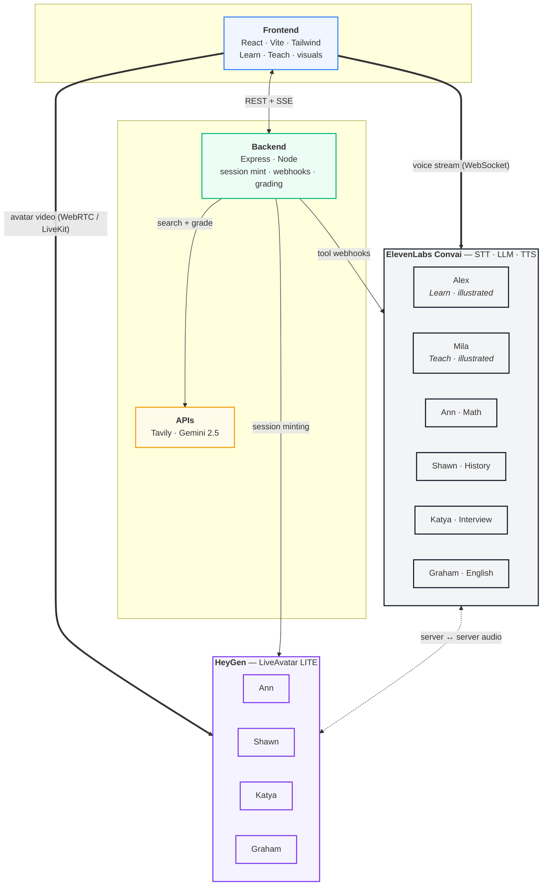

# TutoriAI

> A personal tutor, just for you. Voice-first, face-to-face, grounded in live web search.

Hack Brooklyn · Education track.

## What it is

Two modes, one interface.

**Learn** — talk to a tutor. 5 specialists on call: Alex (generalist, illustrated), Ann (math), Shawn (history), Katya (interview prep), Graham (English). The four specialists come with a HeyGen lip-synced face; Alex is a lightweight illustrated avatar for credit-free rehearsal.

**Teach** — the Feynman technique in reverse. You explain a topic to Mila, a curious illustrated learner. She asks follow-ups until you've covered it. At session end, Gemini 2.5 grades your explanation claim-by-claim against live Tavily search results. You get color-coded feedback: ✅ correct · 🟡 needs clarification · 🔴 incorrect, with sources.

Tutors can paint **live visuals** while they talk — Mermaid diagrams, Desmos graphs, interactive HTML/SVG sandboxes — via a `render_visual` tool call.

## Architecture



A richer interactive version lives at [`frontend/public/architecture.html`](frontend/public/architecture.html) (open via `localhost:5173/architecture.html` during dev).

## How the voice paths work

Two coexisting pipelines. Which one you're on depends on the tutor you picked.

**Direct path — Alex & Mila (illustrated)**
Browser opens a **WebSocket** straight to an ElevenLabs Convai agent via `@elevenlabs/client`. PCM audio up, TTS + transcripts + tool-call requests down. Client tools (like `render_visual`) execute in-browser — zero backend round-trip for visuals.

**HeyGen path — Ann, Shawn, Katya, Graham**
Browser joins a **LiveKit room** (WebRTC) and receives the avatar's face + audio as media tracks. HeyGen in LITE mode handles only lip-sync rendering; STT/LLM/TTS is proxied to a linked ElevenLabs agent server-side. Because the return channel is media-only, server-tool webhooks are used to push visuals back through the backend via SSE.

Backend mints the LiveKit session token so `HEYGEN_API_KEY` never reaches the browser.

## Tech stack

| | |
|---|---|
| Frontend | React 19, Vite, Tailwind v4, `@elevenlabs/client`, LiveKit client |
| Backend | Express on Node, Vercel serverless or local + cloudflared |
| Voice | ElevenLabs Convai (STT + LLM + TTS + tool orchestration) |
| Avatars | HeyGen LiveAvatar (LITE mode) |
| Grounding | Tavily Search |
| Grading | Gemini 2.5-flash |
| Visuals | Mermaid · Desmos · sandboxed HTML/SVG |

## Project layout

```
frontend/     Vite + React SPA
  src/
    lib/            EL direct client, HeyGen hook, visual spec
    components/     TutorPicker, VisualRenderer, modes
  public/
    architecture.html    interactive system diagram

backend/      Express (local dev) / Vercel catch-all
  src/
    app.ts          Express app
    server.ts       local entry
    routes/         /api/config, /session, /visual, /tavily, /feedback
    setup/          one-shot scripts that provision EL agents & tools
  api/
    [...slug].ts    Vercel serverless adapter
```

## Setup

```bash
# Install
(cd frontend && npm install)
(cd backend && npm install)

# Configure backend/.env — see CLAUDE.md for full var list
cp backend/.env.example backend/.env    # if you have an example
# fill in: HEYGEN_API_KEY, ELEVENLABS_API_KEY, TAVILY_API_KEY, GEMINI_API_KEY

# One-time provisioning (writes to ElevenLabs, not this repo)
cd backend
npm run register-secret              # binds EL key to HeyGen → ELEVENLABS_SECRET_ID
npx tsx src/setup/create-alex-agent.ts
npx tsx src/setup/create-student-agent.ts
npx tsx src/setup/create-specialized-agents.ts
npx tsx src/setup/register-tavily-tool.ts
npx tsx src/setup/migrate-visual-tool.ts
npx tsx src/setup/add-client-visual-tool-alex.ts

# Run
(cd backend && npm run dev)    # :3001
(cd frontend && npm run dev)   # :5173
```

Agent prompts, voice IDs, and tool attachments live on ElevenLabs' servers — the `setup/` scripts only write, they don't mirror. Inspect current state with `GET /v1/convai/agents/{id}`.

## Modes flags

- `?mock=1` — bypass HeyGen + EL, drive the UI with fake data (credit-free iteration).
- `?picker=1` — open the HeyGen avatar picker showing all 83 public LiveAvatars.

## Credit constraints

HeyGen free tier: 10 min/month, 2 min/session. Rehearse on Alex (WebSocket path, free). Check balance: `GET /api/session/credits`.

## Demo deployment

Frontend on Vercel. Backend runs locally behind a **cloudflared tunnel** for the live demo — Vercel's multi-instance serverless breaks the in-memory SSE client map that delivers visuals to HeyGen tutors. Point `PUBLIC_BACKEND_URL` at the tunnel URL so ElevenLabs webhooks reach the single local process.

## Acknowledgements

Built on **ElevenLabs Convai**, **HeyGen**, **Tavily**, **Gemini** — plus an espresso budget.
